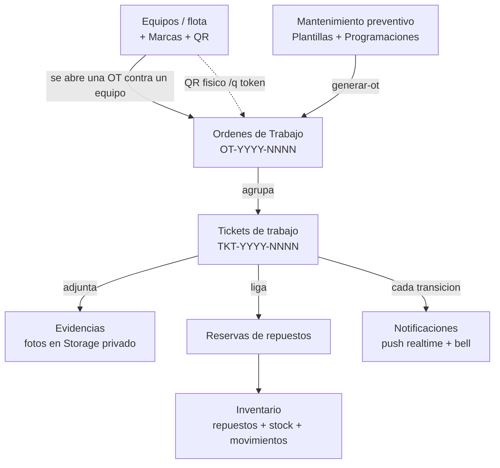
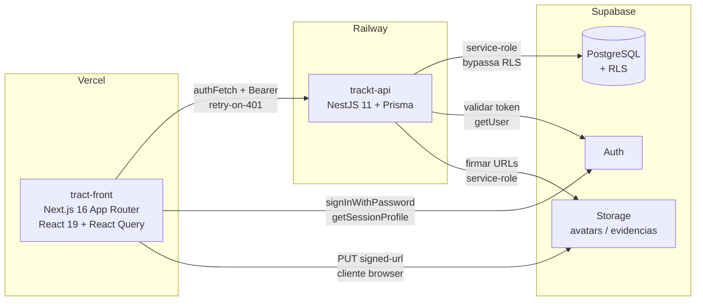
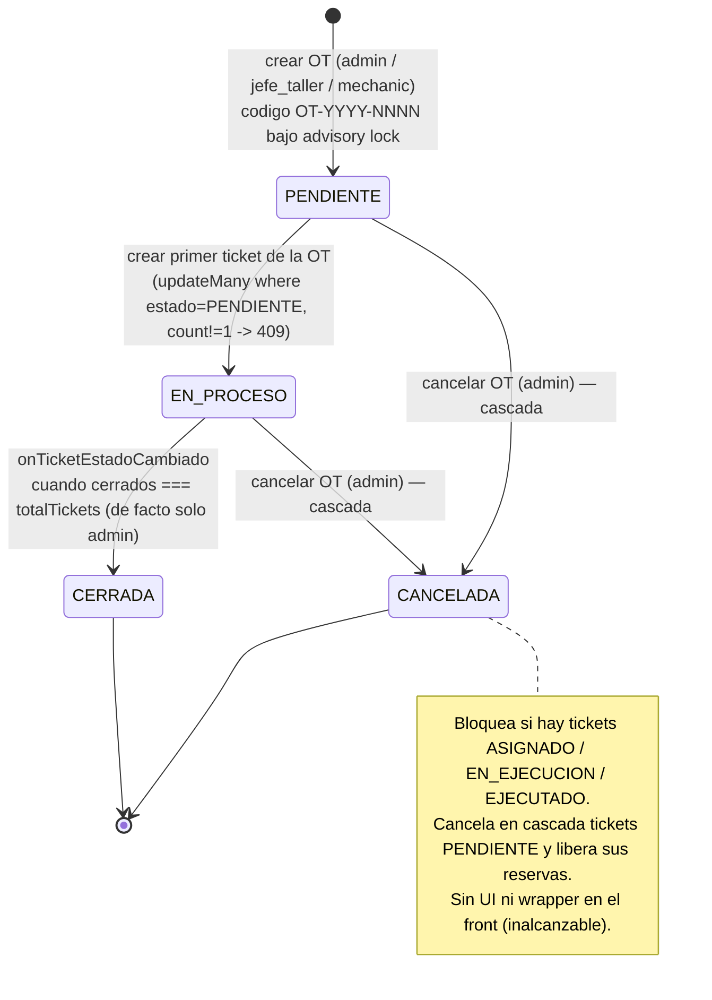
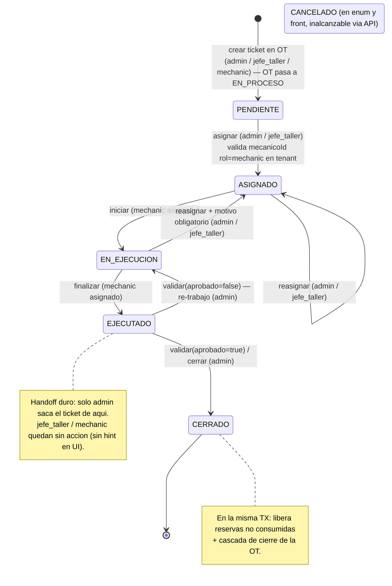
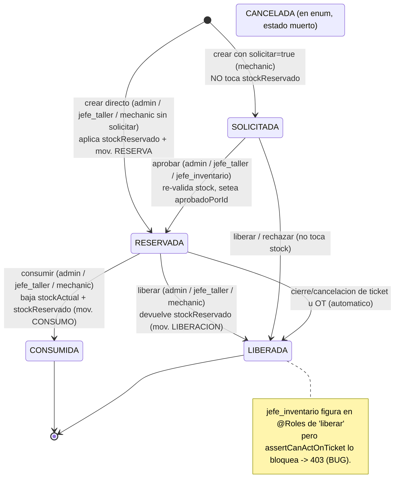
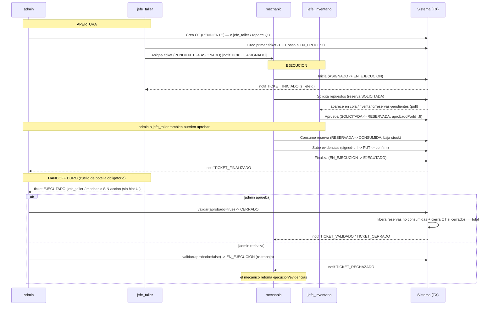
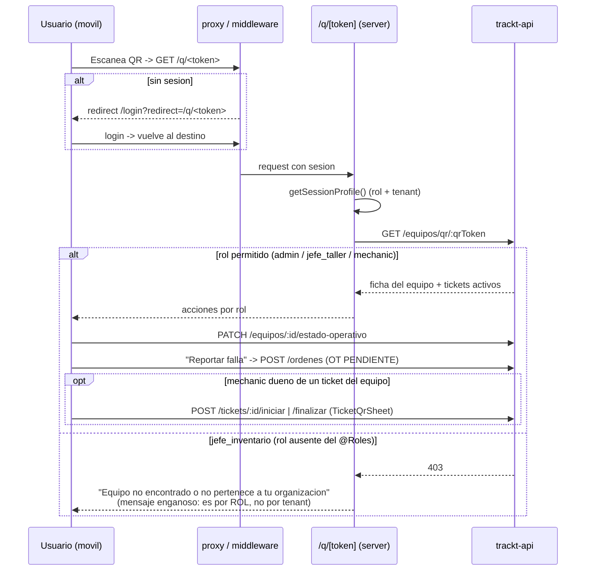

# Flujos de Usuario — Trackt

> Plataforma de gestión de mantenimiento industrial. Documento de referencia funcional: dominios, roles, máquinas de estado y flujos end-to-end por rol y cross-rol.
>
> Convención transversal de autorización (válida para todo el documento): la API NestJS conecta a la base como **service-role y bypassa RLS**. La autoridad real son `AuthGuard → RolesGuard + @Roles(...)` más el *scoping* manual por `tenantId` (siempre derivado del JWT vía `TenantService`, **nunca** del body/query) y por *ownership* (`mecanicoId === user.id`) dentro de cada service. Las RLS de Supabase son defensa-en-profundidad únicamente para el cliente Supabase del browser.

---

## 1. Visión general del sistema

### 1.1 Dominios y modelo de negocio

El núcleo de Trackt es una jerarquía de mantenimiento que fluye **Equipos → Órdenes de Trabajo (OT) → Tickets**, rodeada de dominios de soporte:

| Dominio | Responsabilidad | Entidades clave |
|---|---|---|
| **Equipos** | Catálogo de activos (la "flota"), ficha con resumen + historial agregado, asociación a repuestos habituales y plantillas, token QR opaco regenerable | `equipos`, `equipos_repuestos`, `equipos_plantillas` |
| **Marcas** | Catálogo de marcas con ámbito `EQUIPO` / `REPUESTO` / `AMBOS` | `marcas` |
| **Órdenes de Trabajo (OT)** | Unidad de trabajo contra un equipo; agrupa tickets; código único `OT-YYYY-NNNN` bajo advisory lock por tenant/año | `ordenes_trabajo` |
| **Tickets** | Corazón del flujo: trabajo ejecutable con máquina de estado y timeline de eventos auditados | `tickets`, `eventos_estado_ticket` |
| **Evidencias** | Fotos del trabajo en bucket privado `evidencias`; subida en 3 pasos (signed-url → PUT → confirmar) con revalidación real de mime/size | `evidencias` (+ Storage) |
| **Inventario** | Repuestos por tenant, stock (`stockActual` / `stockReservado` 1:1), historial inmutable de movimientos, y **reservas** ligadas a tickets | `repuestos`, `inventario_stock`, `reservas_repuestos` (+ items), `movimientos_inventario` |
| **Mantenimiento preventivo** | "Recetas" reutilizables (plantillas con checklist + insumos) y programaciones futuras que generan OT+ticket+reserva en una transacción | `plantillas_mantenimiento` (+ items), `programaciones_mantenimiento` |
| **Notificaciones** | Una fila por usuario; emitidas *fire-and-forget* en cada transición de ticket; consumo por polling (60s) + Supabase Realtime con fallback a polling | `notificaciones` |
| **Usuarios / Roles** | Identidades (`public.profiles` con FK a `auth.users`) y los 4 roles del dominio, multi-tenant | `profiles` |

### 1.2 Arquitectura

- **Front (Next.js 16, Vercel)**: tres route groups — `(auth)` (login/forgot/reset, sin sidebar), `(app)` (vistas protegidas con sidebar) y `(qr)` (ficha mobile sin sidebar). La sesión se refresca por request en `proxy.ts → lib/supabase/middleware.ts`. Guards server-side en `lib/auth/require-role.ts` (`requireSession` / `requireRole`). Capa de datos en `lib/api/*` sobre `authFetch`, hooks React Query en `hooks/use-*.ts`, y Server Actions en `app/actions/` (auth, profile, users).
- **API (NestJS 11, Railway)**: módulos por dominio (`equipos`, `ordenes`, `tickets`, `evidencias`, `inventario`, `notificaciones`, `usuarios`, mantenimiento). Guards de auth+rol, `TenantService` para scoping, `PrismaExceptionFilter` global. Las máquinas de estado se ejecutan en los services con guards anti-TOCTOU (`updateMany` con el estado esperado en el `WHERE`; `count !== 1 → 409`) y advisory locks.
- **Supabase**: PostgreSQL (modelo Prisma + migraciones SQL manuales para RLS, triggers, buckets y realtime; **no** se usa `prisma migrate`), Auth (Bearer JWT) y Storage (bucket público `avatars`, privado `evidencias` con path `{tenantId}/{ticketId}/{uuid}`).

**Propagación de identidad** (en ambas capas): `JWT → public.profiles → {role, tenantId}`. En la API se materializa como `AuthUser`; en el front como `SessionProfile` expuesto por `useAuth/useRole/useHasRole`.

---

## 2. Roles y matriz de permisos global

Trackt define **4 roles de dominio**: `admin`, `jefe_taller`, `jefe_inventario`, `mechanic`.

| Rol | Rol en una frase | Landing post-login |
|---|---|---|
| **admin** | Superusuario del tenant: cierra el ciclo (valida/cierra tickets), gestiona identidades y escribe el catálogo maestro | `/dashboard` |
| **jefe_taller** | Coordinación del taller: planifica, abre OT/tickets, asigna/reasigna mecánicos, supervisa carga; **no** cierra el ciclo | `/dashboard` |
| **jefe_inventario** | Rol de bodega: catálogo de repuestos, stock y aprobación de reservas; presencia mínima fuera de inventario | `/inventario` |
| **mechanic** | Ejecutor de terreno (mobile): inicia, consume/solicita repuestos, sube evidencias, finaliza | `/mis-tickets` |

> El landing por rol (`lib/auth/default-route.ts`) también es el destino de *fallback* cuando un rol entra a una página que no le corresponde, evitando bucles de redirect (p. ej. `jefe_inventario` rebotaría desde `/dashboard` a `/inventario`).

### 2.1 Matriz de permisos (rol × acción)

Leyenda: **✅** permitido y funcional · **⛔** bloqueado (rol ausente del `@Roles`) · **🟡** autorizado en API pero sin UI / con fricción · **🐞** declarado en `@Roles` pero **roto en runtime** (403 del service).

| Dominio | Acción | admin | jefe_taller | jefe_inventario | mechanic |
|---|---|:--:|:--:|:--:|:--:|
| **Usuarios** | Listar usuarios (`GET /usuarios`) | ✅ | ⛔ | ⛔ | ⛔ |
| Usuarios | Invitar + asignar rol (Server Action `inviteUser`) | ✅ | ⛔ | ⛔ | ⛔ |
| Usuarios | Editar nombre/avatar propios | 🟡¹ | 🟡¹ | 🟡¹ | 🟡¹ |
| **Equipos** | Listar / ver / resumen / historial | ✅ | ✅ | ⛔ | ✅ |
| Equipos | Crear / editar / desactivar / reactivar | ✅ | ⛔ | ⛔ | ⛔ |
| Equipos | Generar / regenerar QR | ✅ | ⛔ | ⛔ | ⛔ |
| Equipos | Cambiar estado operativo | ✅ | ✅ | ⛔ | ✅ |
| Equipos | Asociar repuesto habitual / plantilla | ✅ | ✅ | ⛔ | ⛔ |
| **Marcas** | Listar catálogo | ✅ | ✅ | ⛔² | ✅ |
| Marcas | Crear / editar / desactivar | ✅ | ⛔ | ⛔ | ⛔ |
| **Órdenes (OT)** | Crear OT | ✅ | ✅ | ⛔ | ✅ |
| Órdenes | Listar / ver / PDF | ✅ | ✅ | ⛔ | 🟡 |
| Órdenes | Crear ticket dentro de OT | ✅ | ✅ | ⛔ | 🟡 |
| Órdenes | Editar descripción/prioridad (`PATCH /ordenes/:id`) | ✅ | ⛔³ | ⛔ | 🟡³ |
| Órdenes | Cancelar OT (cascada) | 🟡⁴ | ⛔ | ⛔ | ⛔ |
| **Tickets** | Listar / ver detalle + timeline | ✅ | ✅ | ⛔ | ✅⁵ |
| Tickets | Ver carga de mecánicos | ✅ | ✅ | ⛔ | ⛔ |
| Tickets | Asignar mecánico | ✅ | ✅ | ⛔ | ⛔ |
| Tickets | Reasignar mecánico | ✅ | ✅ | ⛔ | ⛔ |
| Tickets | Iniciar / finalizar | ⛔ | ⛔ | ⛔ | ✅⁵ |
| Tickets | **Validar** (aprobar/rechazar) | ✅ | ⛔ | ⛔ | ⛔ |
| Tickets | **Cerrar** (forzado) | 🟡⁶ | ⛔ | ⛔ | ⛔ |
| **Inventario** | CRUD repuestos | ✅ | ⛔ | ✅⁷ | ⛔ |
| Inventario | Entrada / ajuste de stock | ✅ | ⛔ | ✅⁷ | ⛔ |
| Inventario | Listar / ver repuestos | ✅ | ✅ | ✅ | ✅⁸ |
| Inventario | Ver movimientos (`/inventario/movimientos`) | ✅ | ✅ | ✅ | ⛔ |
| Inventario | Ver movimientos en detalle de repuesto | ✅ | ✅ | ⛔⁹ | ⛔⁹ |
| **Reservas** | Crear reserva de ticket | ✅ | ✅ | ⛔ | ✅⁵ |
| Reservas | Listar reservas de un ticket | ✅ | ✅ | ⛔ | ✅⁵ |
| Reservas | **Aprobar** (SOLICITADA→RESERVADA) | ✅ | ✅ | ✅ | ⛔ |
| Reservas | **Consumir** (RESERVADA→CONSUMIDA) | ✅ | ✅ | ⛔¹⁰ | ✅⁵ |
| Reservas | **Liberar** (→LIBERADA) | ✅ | ✅ | 🐞¹¹ | ✅⁵ |
| Reservas | Listar pendientes (cola) | ✅ | ✅ | ✅ | ⛔ |
| **Evidencias** | Pedir signed-url / confirmar / descartar / listar | ✅ | ✅¹² | ⛔ | ✅⁵ |
| **Mantenimiento** | CRUD plantillas + items | ✅ | ✅ | ⛔ | 🟡 |
| Mantenimiento | CRUD programaciones | ✅ | ✅ | ⛔ | 🟡 |
| Mantenimiento | Generar OT desde programación | ✅ | ✅ | ⛔ | 🟡 |
| **Reportes** | 6 reportes JSON/CSV | ✅ | ✅ | ⛔ | ⛔ |
| **Notificaciones** | Listar / marcar leídas propias | ✅ | ✅ | ✅¹³ | ✅ |

**Notas de la matriz (asimetrías y gaps confirmados en código):**

1. **🟡 Perfil propio**: `updateProfile`/`uploadAvatar` hacen `UPDATE` a `public.profiles` con el cliente *authenticated*, pero **no existe RLS UPDATE policy** en `profiles` (solo SELECT) → la mutación afecta 0 filas y **falla silenciosamente** para todos los roles.
2. **⛔² Marcas/jefe_inventario**: `GET /marcas` excluye `jefe_inventario`, pero el form de repuestos (que sí gestiona) usa `<MarcaSelect tipo="REPUESTO">` → dropdown "No se pudieron cargar las marcas": **no puede asignar marca a un repuesto**.
3. **③ Asimetría `PATCH /ordenes/:id`**: declara `@Roles('admin','mechanic')` — incluye `mechanic` (que además podría editar **cualquier** OT del tenant, sin check de autoría) pero **excluye `jefe_taller`**, que sí puede crear OT. Probable copy-paste; sin UI ni wrapper en ningún caso → inalcanzable.
4. **🟡⁴ Cancelar OT**: admin-only en backend, **pero sin UI ni wrapper** en el front (`lib/api/ordenes.ts`) → capability inalcanzable desde la app.
5. **⁵ mechanic**: siempre acotado por *ownership* (`mecanicoId === user.id`); ver detalle de ticket ajeno devuelve 404 (oculta existencia).
6. **🟡⁶ Cerrar ticket**: `POST /tickets/:id/cerrar` existe, está testeado y tiene wrapper (`cerrarTicket`/`useCerrarTicket`), pero **ningún componente lo invoca**; el detalle solo expone Aprobar/Rechazar.
7. **⁷ jefe_inventario gestiona desde la lista** (`/inventario`), **no desde el detalle** del repuesto (cuyos botones están gateados solo con `useHasRole('admin')`).
8. **⁸ mechanic** solo ve repuestos **activos**.
9. **⁹ Movimientos en detalle**: `findOneRepuesto` calcula `verMovimientos = role==='admin' || 'jefe_taller'`, dejando `jefe_inventario` y `mechanic` con "Sin movimientos" (falso para jefe_inventario, que sí gestiona stock).
10. **¹⁰ Consumir/jefe_inventario**: el endpoint excluye el rol, pero la UI (`ReservasSection`) habilita el botón → 403 (UI engañosa).
11. **🐞¹¹ BUG `liberar`/jefe_inventario (alta severidad)**: el endpoint declara `@Roles('admin','jefe_taller','jefe_inventario','mechanic')` y pasa el `RolesGuard`, pero `liberarReserva` invoca `assertCanActOnTicket`, helper que **solo** retorna para `admin`/`jefe_taller`/`mechanic`-dueño → `jefe_inventario` cae **siempre** en `ForbiddenException`. Rompe tanto rechazar una solicitud como liberar una RESERVADA.
12. **¹² jefe_taller/evidencias**: el `@Roles` y la tabla `evidencias` lo incluyen, pero el **bucket de Storage no tiene policy para jefe_taller**. Funciona porque el backend firma vía service-role; con el JWT directo daría 403 (inconsistencia latente).
13. **¹³ jefe_inventario/notificaciones**: técnicamente puede listar/marcar las suyas, pero **no existe** tipo de notificación para "reserva solicitada/aprobada" → su cola es **pull** (polling), nunca push.

**Gaps estructurales adicionales** (afectan a varios roles): (a) las páginas `/tickets`, `/ordenes`, `/equipos`, `/marcas`, `/plantillas`, `/mantenciones`, `/reportes` solo hacen `requireSession` server-side (sin `requireRole`); el gating de navegación recae en el sidebar (cosmético) + el `RolesGuard` del backend. (b) `CLAUDE.md` y `UsuarioRol` del front documentan solo 3 roles, omitiendo `jefe_inventario` (riesgo de UI rota al renderizar su rol). (c) El estado `CANCELADO` de ticket y los estados/tipos `ReservaRepuesto.CANCELADA` y `MovimientoInventario.SALIDA` están modelados pero **ningún path los escribe** → filtros fantasma. (d) Notificaciones `OT_CREADA`/`OT_CERRADA` están declaradas y renderizadas pero **nunca se emiten**.

---

## 3. Máquinas de estado

### 3.1 Orden de Trabajo (OT)

### 3.2 Ticket

> Toda transición usa `updateMany` con el estado esperado (y `mecanicoId` cuando aplica) en el `WHERE`; `count !== 1 → 409` (anti-TOCTOU), revirtiendo el evento de timeline ya registrado en `eventos_estado_ticket`.

### 3.3 Reserva de Repuesto

> **Stock**: `entradaStock` (`n → n+cantidad`, mov. ENTRADA) y `ajusteStock` (`n → valor absoluto`, mov. AJUSTE, 409 si `< stockReservado`) son mutaciones de `InventarioStock`, no transiciones FSM, y las ejecutan `admin`/`jefe_inventario`. Consistencia protegida con `pg_advisory_xact_lock` por repuesto (orden lexicográfico anti-deadlock) y revalidación de stock dentro de cada TX.

---

## 4. Flujo end-to-end por rol

### 4.1 Admin — superusuario del tenant

El **admin** es el único rol que **cierra el ciclo de negocio** (valida y cierra tickets, lo que cascada el cierre de OTs y libera inventario), el único que **gestiona identidades** (invita usuarios, asigna roles) y el único que **escribe el catálogo maestro** de equipos y marcas. Tiene el conjunto más amplio de permisos del sistema.

**Al entrar.** Aterriza en `/dashboard` (KPIs). Es el único rol que ve TODOS los grupos del sidebar, incluido el grupo exclusivo **Administración** (Pendientes de validar, Marcas, Usuarios). El item **"Pendientes de validar"** (`/tickets?estado=EJECUTADO`) es el atajo a su responsabilidad exclusiva: la cola de tickets esperando validación.

**Capacidades por dominio:**

- **Usuarios (exclusivo)**: lectura vía API (`GET /usuarios`), pero la **mutación vive en Server Actions** que saltan la API y escriben directo a Supabase con service-role. `inviteUser` crea el auth user (`inviteUserByEmail`) y upserta el profile con `role` + `tenant_id` **forzado a `session.tenantId`**; si el upsert falla, compensa borrando el auth user.
- **Equipos y Marcas (escritura exclusiva)**: CRUD completo de la flota y del catálogo de marcas; genera/regenera el token QR (invalida el impreso anterior). Desactivar es baja lógica (`activo=false`), idempotente, sin hard delete.
- **OT**: comparte creación con jefe_taller/mechanic, pero es el **único que cancela** (con cascada: cancela tickets PENDIENTE y libera sus reservas).
- **Tickets (dueño del cierre)**: participa en asignación, pero **monopoliza validación y cierre**. *Happy path de validación*: (1) el mecánico finaliza → ticket **EJECUTADO**, notifica `TICKET_FINALIZADO`; (2) admin entra al detalle, ve `canValidar = isAdmin && EJECUTADO`; (3) **Aprobar** → **CERRADO**, en la misma TX libera reservas no consumidas + propaga cierre de OT, notifica `TICKET_VALIDADO/CERRADO`; (4) **Rechazar** → vuelve a **EN_EJECUCION** (re-trabajo), notifica `TICKET_RECHAZADO`.
- **Inventario**: tiene el set más amplio de permisos de reserva — es el único rol que ejecuta las 4 operaciones (crear, aprobar, consumir, liberar) sin caer en inconsistencias, tanto desde la cola `/inventario/reservas-pendientes` como desde el detalle del ticket.
- **Mantenimiento, Evidencias, Reportes**: CRUD de plantillas/programaciones, acceso total a evidencias del tenant, y los 6 reportes en JSON/CSV.

**Transiciones exclusivas que dispara**: `EJECUTADO → CERRADO` (validar/cerrar), `EJECUTADO → EN_EJECUCION` (rechazo), `PENDIENTE|EN_PROCESO → CANCELADA` (cancelar OT), y la baja/reactivación/regeneración-QR de equipos.

**Fricciones específicas del admin**: cancelar y editar OT son capabilities de backend **sin UI** (dead-end); puede crear **otros admins sin límite** y no existe edición/baja de usuarios (la tabla es solo lectura) → degradar a un admin requeriría SQL manual; el ticket generado desde una programación nace **PENDIENTE huérfano** (el `responsableId` no se propaga) y debe asignarlo manualmente sin que nadie sea notificado.

### 4.2 Jefe de taller — coordinación del taller

El **jefe_taller** es el "puente" entre quien decide (admin) y quien ejecuta (mechanic): planifica el trabajo preventivo, abre OT y tickets, **asigna y reasigna mecánicos**, supervisa la carga del equipo y gestiona reservas contra tickets. Su frontera dura: **no cierra el ciclo** (no valida ni cierra tickets), no escribe inventario (catálogo/stock) ni equipos, y no cancela OT.

**Al entrar.** Aterriza en `/dashboard`. Ve los grupos General, Inventario, Taller (Carga de mecánicos) y Cuenta. **No** ve Administración ni "Mi trabajo".

**Flujo feliz del rol:**

1. **Planifica** (Mantenimiento): crea **plantillas** (recetas con checklist + insumos), las asocia a equipos, y crea **programaciones** (estado PROGRAMADA). Genera la OT desde la programación (`generar-ot`) → en una TX crea OT (PENDIENTE→EN_PROCESO), ticket (PENDIENTE, sin asignar) y reserva de insumos; para jefe_taller la reserva nace **RESERVADA** (modo `AUTOMATICA`; 409 si falta stock).
2. **Abre trabajo correctivo**: crea la OT (PENDIENTE) y el primer ticket → la OT transiciona a **EN_PROCESO** atómicamente.
3. **Distribuye carga** (núcleo del rol, en `/tickets` kanban + lista): consulta `/taller/carga` para detectar sobrecarga y **asigna** un ticket PENDIENTE a un mecánico (→ ASIGNADO, notifica `TICKET_ASIGNADO`). **Reasigna** desde ASIGNADO/EN_EJECUCION (motivo obligatorio si EN_EJECUCION; notifica a mecánico nuevo **y** anterior).
4. **Gestiona reservas** contra tickets: crea reserva directa (RESERVADA), **aprueba** solicitudes de mecánicos (SOLICITADA→RESERVADA), consume y libera.
5. **Supervisa**: recibe `TICKET_INICIADO` / `TICKET_FINALIZADO` (si es el `jefeId`), revisa evidencias.
6. **Handoff a admin**: cuando el mecánico deja el ticket en **EJECUTADO**, el jefe_taller **no tiene acción** (validar/cerrar es admin-only); el detalle calcula `canValidar = isAdmin && EJECUTADO`, así que ve el ticket esperando sin botón.

**Transiciones que dispara**: `PENDIENTE → ASIGNADO` (asignar), `ASIGNADO|EN_EJECUCION → ASIGNADO` (reasignar), `(none) → PENDIENTE` y `PENDIENTE → EN_PROCESO` (crear OT/ticket), y todo el sub-árbol de reservas salvo aprobación final del ciclo.

**Fricciones específicas**: crea la OT pero **no puede editarla** después (asimetría de `@Roles` que lo excluye); **dead-end percibido** en EJECUTADO sin hint en UI; el `responsableId` de la programación no se propaga al ticket generado.

### 4.3 Jefe de inventario — rol de bodega

El **jefe_inventario** gestiona el catálogo de repuestos, el stock (entradas/ajustes) y la **aprobación de reservas** ligadas a tickets. Su centro de gravedad es exclusivamente el dominio **inventario**; sobre el resto (equipos, órdenes, tickets, mantenimiento, evidencias, reportes, usuarios) tiene presencia nula.

**Al entrar.** Aterriza en **`/inventario`** (no `/dashboard`, para evitar el bucle de redirect). El sidebar le muestra **solo el grupo "Inventario"** (Inventario, Movimientos, Solicitudes pendientes) más Cuenta. Las páginas de inventario sí tienen `requireRole` server-side real; al navegar a mano a `/tickets` u otras, la página carga (sin guard) pero el sidebar no la ofrece.

**Flujo feliz del rol:**

1. **Catálogo y stock** (desde la lista `/inventario`, donde sí ve los botones): crea repuesto (genera `Repuesto` + `InventarioStock` 1:1 + movimiento ENTRADA inicial), registra **entrada** de N unidades, **ajusta** a valor absoluto (observación obligatoria), edita o desactiva (409 si `stockReservado > 0`).
2. **Aprobación de reservas (acción estrella)**: un mecánico solicita repuestos (`solicitar=true` → reserva **SOLICITADA**, sin tocar stock); el jefe_inventario entra a **`/inventario/reservas-pendientes`**, ve la cola (`GET /reservas-repuestos`) y pulsa **Aprobar** → el service re-valida stock (anti-TOCTOU), toma lock por SKU, aplica `stockReservado`, emite movimiento RESERVA y setea `aprobadoPorId` → **RESERVADA**.
3. **Reabastecimiento proactivo**: entradas/ajustes para que haya disponibilidad cuando se aprueben futuras reservas.

**Única transición de estado que dispara con éxito**: `SOLICITADA → RESERVADA` (aprobar). Además escribe movimientos ENTRADA, AJUSTE y RESERVA. **No** escribe CONSUMO ni LIBERACION.

**Fricciones críticas del rol (matriz controller-vs-front incoherente):**
- **BUG "liberar" (alta)**: figura en `@Roles` pero `assertCanActOnTicket` lo bloquea → **siempre 403**, tanto al rechazar una solicitud como al liberar una RESERVADA.
- **UI engañosa "consumir"**: `ReservasSection` habilita el botón, pero el endpoint (y el de listar reservas del ticket) excluye el rol → 403.
- **Marcas inaccesibles**: el form de repuestos no puede cargar el `<MarcaSelect>` → no asigna marca.
- **Detalle de repuesto sin movimientos** y **acciones de stock invisibles en el detalle** (gateadas a admin).
- **RLS nula**: la migración del rol solo agregó la policy de SELECT en `profiles`; no hay policies de inventario para `jefe_inventario`, así que solo funciona vía service-role del backend.
- **QR dead-end**: ver §6.

### 4.4 Mechanic — ejecutor de terreno

El **mechanic** recibe tickets ya asignados, los inicia, consume/solicita repuestos reservados, sube fotos de evidencia y finaliza. **No** asigna, **no** valida, **no** cierra. Su mundo está pensado para mobile: dos superficies (`/mis-tickets` y la ficha QR `/q/[token]`) más inventario en solo-lectura.

**Al entrar.** Aterriza en `/mis-tickets`. El sidebar muestra **un solo link real**: "Mis tickets" (grupo "Mi trabajo") más Mi perfil. El aislamiento es **asimétrico**: `/inventario`, `/dashboard`, `/taller`, `/usuarios` redirigen limpio, pero `/tickets`, `/ordenes`, `/equipos`, `/marcas`, `/plantillas`, `/reportes` **no tienen guard de rol server-side** y se renderizan (en `/tickets` el backend acota su lista a sus propios tickets; en `/reportes` la API responde 403 y la UI queda en error).

**Happy path — ejecutar un ticket asignado:**

1. **Login** → `/mis-tickets` (el backend ignora cualquier `mecanicoId` del query y fuerza `mecanicoId = user.id`).
2. **Recibe** `TICKET_ASIGNADO` (push realtime + bell).
3. **Abre el ticket** `/mis-tickets/[id]` (404 si no es suyo). Ve equipo, prioridad, timeline y `ReservasSection` embebida.
4. **Inicia** → `POST /tickets/:id/iniciar` → **ASIGNADO → EN_EJECUCION** (doble check `mecanicoId===userId`). Notifica al jefe `TICKET_INICIADO` (si hay `jefeId`).
5. **Consume repuestos reservados** → por cada RESERVADA, "Consumir" → **RESERVADA → CONSUMIDA** (baja `stockActual` y `stockReservado`, mov. CONSUMO).
6. **Sube evidencia** (3 pasos): `signed-url` → `PUT` directo al bucket → `confirm` (el backend revalida mime/size reales y borra si no cumplen; limpieza best-effort vía `/descartar`).
7. **Finaliza** → habilitado en el front solo con ≥1 evidencia (gating de UX, evadible por API) → `POST /tickets/:id/finalizar` → **EN_EJECUCION → EJECUTADO**. Notifica `TICKET_FINALIZADO`.
8. **Handoff de salida**: ticket EJECUTADO esperando a un **admin**.
9. **Veredicto** (notificación): aprobado → `TICKET_VALIDADO/CERRADO` (cascada); rechazado → `TICKET_RECHAZADO` y vuelve a EN_EJECUCION → el mecánico **retoma** desde el paso 5/6.

**Caminos alternativos**: (A) **falta de stock** → crea reserva con `solicitar=true` (SOLICITADA) y espera la aprobación de un gestor; puede **liberar** su propia reserva. (B) **reasignación** → recibe `TICKET_ASIGNADO` y **pierde acceso** (404) si lo ceden. (C) **origen por QR** (ver §6): reporta falla → OT. (D) **inventario solo-lectura** en `/inventario/repuestos/[id]` (movimientos vacíos).

**Transiciones que dispara**: exactamente dos de ticket — `iniciar` (ASIGNADO→EN_EJECUCION) y `finalizar` (EN_EJECUCION→EJECUTADO); más crear/consumir/liberar reservas de **su** ticket. El mechanic es **terminal de ejecución**: nunca cierra el ciclo.

**Fricciones específicas**: la edición de perfil propio **no persiste** (sin RLS UPDATE); en la lista `/mis-tickets`, "Subir foto"/"Finalizar" para estados ≠ ASIGNADO son solo `<Link>` al detalle (TODO de deep-link sin implementar); puede **liberar unilateralmente** stock RESERVADA aprobado por un jefe (asimetría con aprobar, que lo excluye); capabilities muertas de `generar-ot` y `PATCH /ordenes/:id` (en `@Roles` pero sin UI).

---

## 5. Flujos cross-rol / handoffs

El ciclo de vida completo de un ticket atraviesa los 4 roles. El **admin** es el vértice de coordinación (entrega estructura, recibe trabajo para validación); el **jefe_taller** distribuye; el **mechanic** ejecuta; el **jefe_inventario** aprueba el stock.

**Tabla de handoffs (quién entrega / quién recibe):**

| Momento | Entrega | Recibe | Mecanismo |
|---|---|---|---|
| Apertura | admin / jefe_taller (crea OT+ticket) | mechanic | Asignación → notif `TICKET_ASIGNADO` |
| Falta de stock | mechanic (solicita, SOLICITADA) | jefe_inventario / admin / jefe_taller | Cola `/inventario/reservas-pendientes` (pull, sin push) |
| Stock apartado | jefe_inventario (aprueba, RESERVADA) | mechanic / admin | `RESERVADA` lista para consumir |
| Inicio / fin de ejecución | mechanic | jefe_taller (jefeId) | notif `TICKET_INICIADO` / `TICKET_FINALIZADO` |
| Entrega para cierre | mechanic / jefe_taller | **admin** (único que valida) | Ticket en EJECUTADO |
| Veredicto | admin | mechanic | `TICKET_VALIDADO/CERRADO` o `TICKET_RECHAZADO` (vuelve a EN_EJECUCION) |
| Cierre en cascada | admin (al cerrar el último ticket) | Sistema | OT → CERRADA + `liberarReservasDeTicket` (automático, misma TX) |
| Reasignación | admin / jefe_taller | mechanic nuevo (el saliente pierde acceso, 404) | `TICKET_ASIGNADO` doble emit |

**Punto crítico de handoff — la cola de validación.** El mecánico (o el jefe_taller vía reasignación) deja tickets en EJECUTADO; **solo el admin** los puede sacar de ahí. Si el admin no actúa, la OT **nunca cierra** (el cierre exige `cerrados === totalTickets`). Un único ticket en bucle de rechazo, o atascado en EJECUTADO, **bloquea para siempre** el cierre automático de la OT, y la única salida (cancelar OT) está bloqueada si ese ticket está activo y además **no tiene UI**. No existe cancelación individual de tickets.

---

## 6. Flujo QR mobile (`/q/[token]`)

Cada equipo tiene un `qrToken` opaco (UUID v4, regenerable por el admin, que invalida el anterior). El front renderiza el QR como SVG codificando la **URL navegable** `NEXT_PUBLIC_SITE_URL/q/<token>` (no el token crudo). La página `/q/[token]` vive en el route group `(qr)` (shell **sin sidebar**), exige sesión y resuelve el equipo por `GET /equipos/qr/:qrToken` filtrado por tenant (404 si es de otro tenant). Las acciones se diferencian por rol vía `useRole()`.

**Acceso por rol en el QR:**

| Rol | Resuelve equipo | Cambiar estado operativo | Reportar falla → OT | Iniciar/Finalizar ticket |
|---|:--:|:--:|:--:|:--:|
| **admin** | ✅ | ✅ | ✅ | — (no es dueño; genera/regenera el QR en desktop) |
| **jefe_taller** | ✅ | ✅ | ✅ | — |
| **mechanic** | ✅ | ✅ | ✅ | ✅ solo si `isOwnerMechanic` (dueño del ticket) |
| **jefe_inventario** | ⛔ 403 | ⛔ (botón visible, 403 al pulsar) | ⛔ (`canReportar` lo excluye) | ⛔ |

- **Doble guard** para todos: middleware + `getSessionProfile()` en el server component.
- **admin / jefe_taller**: resuelven la ficha, cambian estado operativo y reportan fallas (crean OT PENDIENTE que luego se convierte en tickets). El admin además es quien **genera/regenera el QR físico** desde el detalle del equipo en desktop, cerrando el ciclo.
- **mechanic**: además del cambio de estado y reportar falla, ve el bottom-sheet `TicketQrSheet` para **iniciar/finalizar** su ticket sin salir del móvil (mismas transiciones que el happy path), pero **solo si es el dueño** (`role==='mechanic' && ticket.mecanico.id===auth.id`).
- **jefe_inventario**: la página QR es un **dead-end** — el endpoint de resolución excluye el rol y devuelve 403, que la UI muestra como "Equipo no encontrado" (mensaje engañoso: el rechazo es por rol, no por tenant). En la práctica este rol nunca usa el flujo QR.
